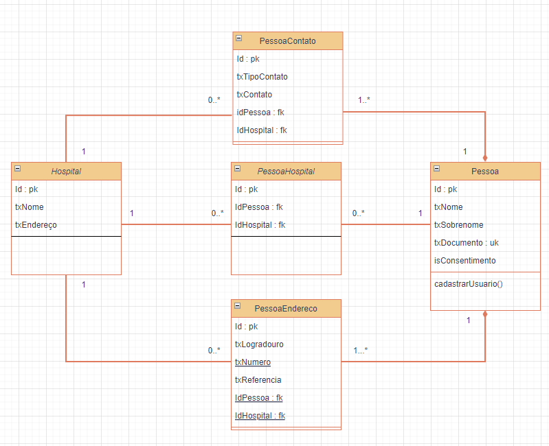
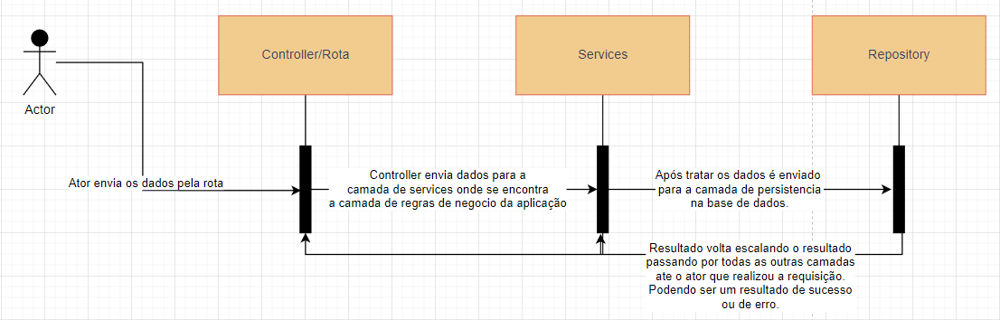

# Motor de cadastro de usuário

Esse é um desafio técnico para a empresa Hoobox. O desafio consistem em realizar a construção de um motor de cadastro de usuário com as seguintes regras: 

- Sua solução aborda a premissa de que todo usuário tem um documento único de identificação;
- Todo usuário que chega a um Hospital se cadastra com esse documento, porém, não indica em local nenhum seu consentimento para compartilhamento de dados (LGPD)
- Todo local novo que ele for, deve ser cadastrado novamente, devido ao item anterior.
- Existe um método que o usuário pode se cadastrar, e que, uma vez que ele cadastre e dê o consentimento como titular dos dados, seus dados podem ser disponibilizados em qualquer local que use sua solução.

Tendo essas informações como base realizei a construção de um diagrama de classes tentando extrair algumas entidades para montar os devidos relacionamentos e construção do banco de dados.



Pode ser visto que no diagrama indiquei os relacionamentos de cada entidade e já informando o que seria `primary key` e o que seria `foreign key`. Para ter certeza que o documento da pessoa fosse unico, marquei o atributo txDocumento como sendo uma `unique key`, forma de dizer no banco de dados que aquela informação é unica.

## Tecnologias

| Tecnologias | Descrição
| ----------- | ---------
| NodeJS + TypeScript + Express | Linguagem e Framework usado
| sequelize | ORM (Foi utilizado mas especificamente as Raw Queries)
| tsyringe | Biblioteca para auxiliar na injeção de dependencia
| uuidv4 | Biblioteca para auxiliar na geração de ID das classes
| validation-br | Biblioteca para auxiliar na validação do documento (cpf) da pessoa
| MySQL | Banco de dados relacional
| Docker | Container para o banco de dados utilizado

## Padrões

Na construção desse projeto foram utilizados dois padrões de projeto como:

  - Arquitetura limpa
  - Repositorios
  - Aplicado alguns principios do SOLID
  
    - **Single responsibility principle:** Cada camada tem sua responsabilidade, ou seja, na camada de `controller`, a função dela é estrair as informações da requisição e passar adiante, na camada de `service`, é onde se encontra o tratamento da regra de negocio e por fim, na cama de `data` é a camada de persistência com a base de dados. Essas camadas estão isoladas e não dependem uma da outra para existir.
    - **Interface segregation principle:** É definida varias interfaces para firmar contrato com os repositories.
    - **Dependency inversion principle:** Na camada de `domain`, onde se encontra as entidades e as assinaturas do `repositories` pode ser encontrado os contratos que a camada de `data` usa para a implementação das persistências.



## como rodar o projeto

*Antes de mais nada é necessario ter o nodeJS, yarn e o docker instalado na maquina.*

Após realizar o clone da aplicação, inicie o banco de dados com o comando:

```sh
docker compose up
```

Depois de subir o banco, que já terá alguns dados populados pois o volume do container está dentro do repositorio, basta iniciar a API pelo terminal usando o comando abaixo:

```sh
yarn start
```

Você já poderá realizar requisições, eu utilizei o [insomnia](https://insomnia.rest/) para realizar os teste. Aqui é de sua preferencia.

No arquivo de `routes.ts` você poderá ver as rotas criadas.

> *Algumas melhorias que poderiam ser vistas para o projeto:*
>
>> Utilizar o swagger para uma melhor documentação da API;
>
>> Inicializar a API com o docker-compose após levantamento do banco de dados;
>
>> Melhorar a camada de persistência da aplicação;
